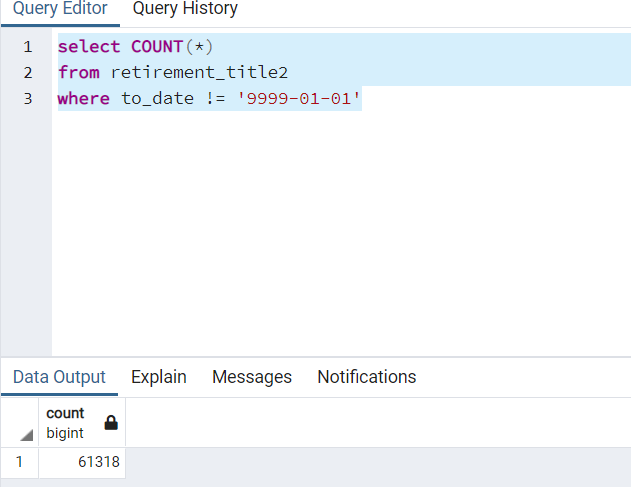
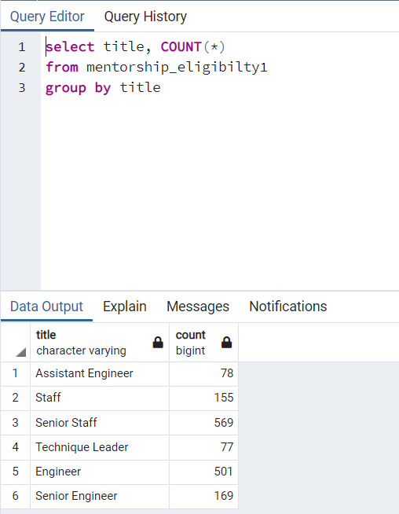

# Employee Database with SQL

## Overview of the analysis

- The purpose of this project is to determine the number of retiring employees per title, and identify employees who are eligible to participate in a mentorship program by using SQL. New tables are made to help the manager better prepare for the silver tsunami. 

## Results

- There are 29414 senior engineers and 28254 senior staffs retiring. 64% of those who are retiring has a senior title.

- As of those who are eligible for mentorship, 738 out of 1550 have senior titles. That is nearly 50% (around 47.6%).

- There are 133,777 rows in retirement_titles.csv and only 90,399 rows in unique_titles.csv. Assuming each person only changes their position once, this shows that 43,378 of those who are retiring changed their position over their course of career at Pewlett Hackard. 

- There are only 2 managers retiring, which is good news for the company since generally administrative positions are harder to fill.

## Summary

- How many roles will need to be filled as the "silver tsunami" begins to make an impact?
  - There are 90,398 roles needed to be filled.
  
- Are there enough qualified, retirement-ready employees in the departments to mentor the next generation of Pewlett Hackard employees?
  - There are 1550 employees qualified for mentorship and there are going to be 90,398 new employees filling up the retirement spots, so it is not likely that there are enough qualified, retirement-ready employees to mentor the new generation. However, this might not be a huge problem, since the new generation are more familiar with technology to begin with, and the company would develop and mature more over the years, which would help in times of hardship. 
  
- This query shows that 61,318 out of 133,777 rows in retirement_titles do not have the to_date as '9999-01-01', which means that those people quit before the age of retirement. 

- This query shows the number of each title of employees who are eligible for mentorship. 

